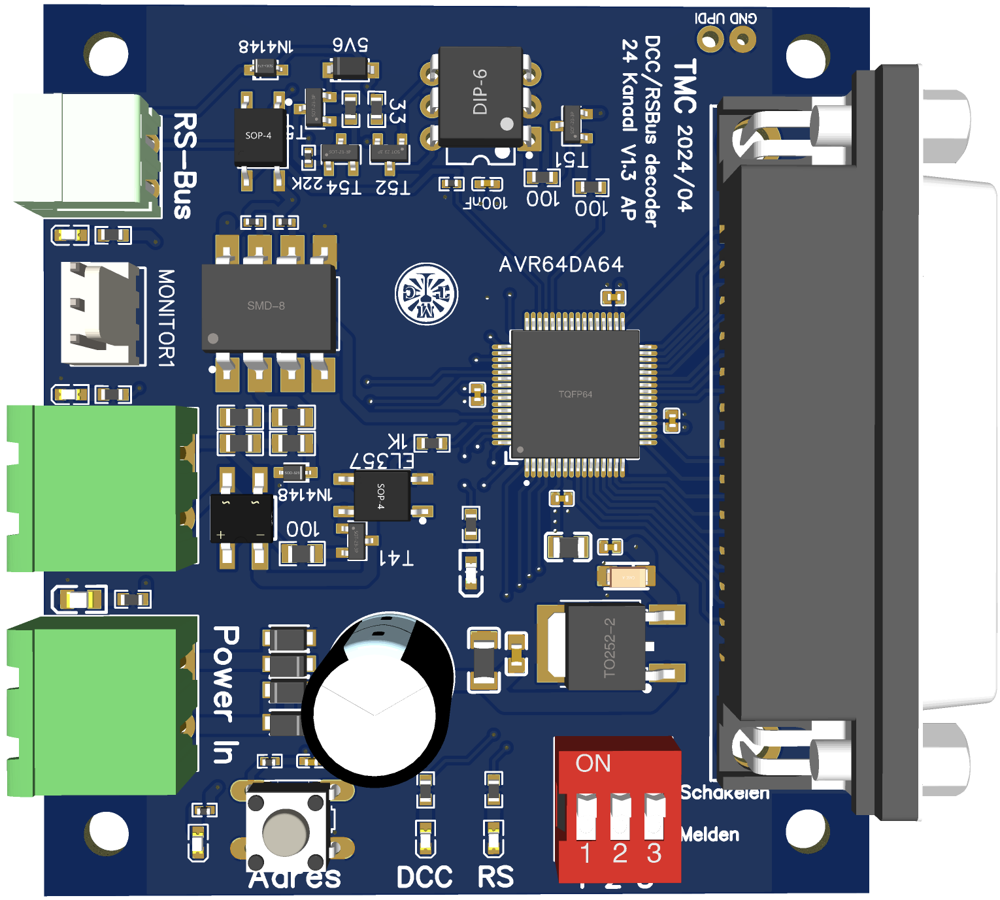

# TMC 24 Channel IO Decoder
Arduino code for the 24 Channel (SUBD-25 connector) I/O Decoder for DCC Accessory Commands and RS-Bus Feedback. This decoder was developed for the  Twentse Modelspoorweg Club (TMC). For usage details, see the [Manual](Documentation/Manual_24_Channel_IO_decoder.pdf).

The decoder hardware can be found on OSWHLAB: https://oshwlab.com/aikopras/io-24-channel_copy

# TMC 24 Kanaals IO decoder
Arduino code voor de 24 Kanaal (SUBD-25 connector) I/O Decoder voor DCC Accessory Commando's and RS-Bus terugmelding. Deze decoder is ontwikkeld voor de Twentse Modelspoorweg Club (TMC). Voor informatie hoe deze decoder gebruikt kan worden, zie de [Handleiding](Documentation/Handleiding_TMC_24Kanaal_Decoder.pdf).

De hardware voor deze decoder is te vinden op OSHWLAB: https://oshwlab.com/aikopras/io-24-channel_copy
